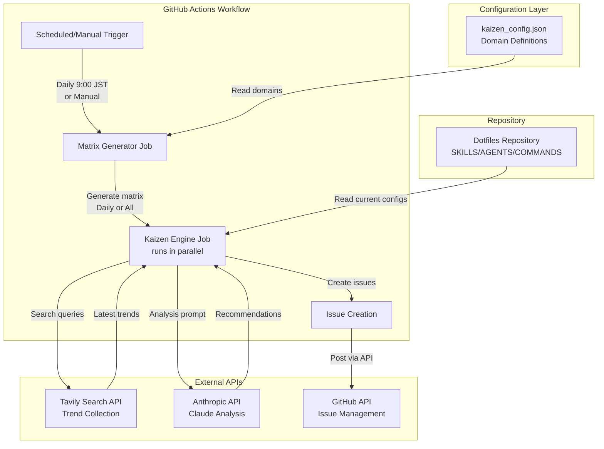
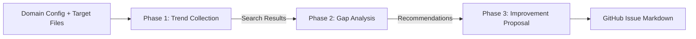
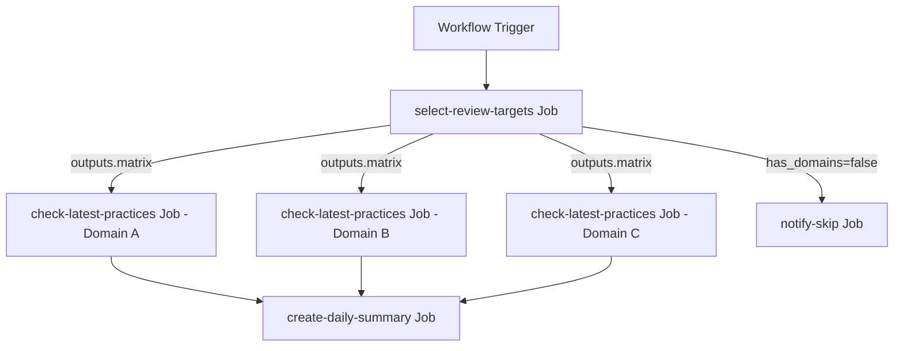

# Dotfiles Kaizen Workflow Architecture

本ドキュメントは、Dotfiles Kaizen Workflowのアーキテクチャ詳細について記述します。

## 1. アーキテクチャ概要

### 1.1 システム構成図



### 1.2 登場人物と責務

| コンポーネント                     | 役割               | 技術要素                        |
|-----------------------------|--------------------|---------------------------------|
| **GitHub Actions Workflow** | オーケストレーション層       | YAML定義、Cron式、Matrix戦略      |
| **Configuration**           | ドメイン定義とメタデータ管理 | JSON、バリデーションロジック                |
| **Matrix Generator**        | 実行対象の動的決定  | Bash、jq、日付計算、Matrix JSON出力 |
| **Kaizen Engine**           | 3フェーズの分析エンジン     | Python、API統合、プロンプトエンジニアリング    |
| **External APIs**           | 知識ソースと出力先     | REST API、認証管理               |

---

## 2. コンポーネント詳細設計

### 2.1 Configuration (`kaizen_config.json`)

#### 2.1.1 データ構造

```json
{
  "version": "1.0",
  "domains": [
    {
      "id": "typescript-best-practices",
      "name": "TypeScript Best Practices",
      "description": "TypeScript開発におけるコーディング規約とパターン",
      "day_of_week": 1,
      "target_files": [
        "home/dot_claude/skills/typescript-best-practices/**/*.md"
      ],
      "search_hints": {
        "primary_keywords": ["TypeScript", "best practices", "2025"],
        "focus_areas": ["型安全性", "パフォーマンス", "セキュリティ", "ツール連携"],
        "exclude_terms": ["JavaScript基礎", "tutorial", "beginner", "入門"]
      },
      "analysis_context": {
        "current_version": "TypeScript 5.x",
        "priority_aspects": ["セキュリティ", "最新文法対応", "型システムの活用"]
      }
    }
  ],
  "global_settings": {
    "max_search_results": 10,
    "analysis_temperature": 0.3,
    "issue_labels": ["dotfiles-kaizen"]
  }
}
```

#### 2.1.2 設計意図

- **`id`**: システム内部での一意識別子（ファイル名、Issue titleに使用）
- **`day_of_week`**: 実行曜日を指定（月曜=1, 日曜=7 / ISO 8601準拠）
  - シンプルな週次スケジュール管理
  - MODE=dailyの場合、この値でフィルタリング
  - MODE=allの場合、全ドメインを実行（day_of_weekは無視）
- **`search_hints`**:
  - `primary_keywords`: Tavily検索の基本クエリ
  - `focus_areas`: 日本語での補足コンテキスト（プロンプトで活用）
  - `exclude_terms`: ノイズ除去用（初心者向けチュートリアルなど）
- **`analysis_context`**: AIへの分析指示を明示化し、再現性を確保

### 2.2 Matrix Generator (`generate_matrix.sh`)

#### 2.2.1 責務
- 設定ファイルから実行対象ドメインを決定
- GitHub Actions Matrixフォーマットへの変換
- 実行モード（Daily/All）による振り分けロジック

#### 2.2.2 入出力定義

**入力:**
- `kaizen_config.json`: 全ドメイン定義（第1引数、デフォルト: `scripts/kaizen_config.json`）
- 実行モード（環境変数 `MODE`: `daily` or `all`、デフォルト: `daily`）
- 現在の曜日（UTC）または `TEST_DAY_OF_WEEK`環境変数（テスト用）

**出力:**
- GitHub Actions Matrix JSON（標準出力、コンパクト形式）
```json
[
  {
    "domain_id": "typescript-best-practices",
    "domain_name": "TypeScript Best Practices"
  }
]
```

#### 2.2.3 実装詳細

**技術スタック:**
- Bash (set -euo pipefail)
- jq（JSONパース・フィルタリング）
- date（曜日計算）

**Dailyモード:**
```bash
1. 現在のUTC曜日を取得（ISO: 1=Monday, 7=Sunday）
   TODAY="${TEST_DAY_OF_WEEK:-$(date -u +%u)}"
2. jqで該当曜日のドメインをフィルタリング
   select(.day_of_week == $today)
3. domain_id/domain_nameのみを抽出してJSON配列を生成
```

**Allモード:**
```bash
1. 全ドメインを取得
2. domain_id/domain_nameのみを抽出してJSON配列を生成
```

**エラーハンドリング:**
- 設定ファイルが存在しない場合: エラーメッセージを標準エラー出力、終了コード1

#### 2.2.4 テスト

`tests/generate_matrix.bats`で包括的なテストを実装：
- 実行可能性の検証
- エラーハンドリング（設定ファイル不在）
- MODE=allでの全ドメイン返却
- MODE=dailyでの曜日フィルタリング（月/水/金/日）
- JSON形式の妥当性検証
- GitHub Actions Matrix形式への準拠確認

全12テストが環境変数モック（`TEST_DAY_OF_WEEK`）により日付非依存で実行可能。

### 2.3 Dotfiles Kaizen Engine (`dotfiles_kaizen.py`)

#### 2.3.1 3フェーズの処理フロー



#### 2.3.2 Phase 1: Trend Collection（Tavily API）

**目的:**
最新の技術トレンド、ベストプラクティス、セキュリティ勧告を収集

**処理内容:**
1. **検索クエリの構築**
   ```python
   query = f"{primary_keywords} {focus_areas} {current_year}"
   # 例: "TypeScript best practices 型安全性 パフォーマンス 2025"
   ```

2. **Tavily API呼び出し**
   - `search_depth`: "advanced"（より深い分析を要求）
   - `max_results`: 設定ファイルから取得（デフォルト10件）
   - `include_domains`: 信頼できるソース（例: GitHub公式、Microsoft Docs）を優先
   - `exclude_domains`: 低品質なコンテンツファームを除外

3. **結果のフィルタリング**
   - 公開日が1年以内のコンテンツを優先
   - `exclude_terms`に一致する記事を除外
   - スコアリング上位N件を選択

#### 2.3.3 Phase 2: Gap Analysis（Anthropic API）

**目的:**
検索結果と既存設定を比較し、具体的な改善提案を生成

**処理内容:**

1. **既存ファイルの読み込み**
   ```python
   # target_filesのglob展開
   current_content = read_files_matching(domain.target_files)
   ```

2. **プロンプトの構築**
   ```
   あなたはkaizen advisorです。以下の情報を元に、dotfiles内の設定改善案を提案してください。

   ## 現在の設定
   {current_content}

   ## 最新トレンド（2025年1月調査）
   {research_summary}

   ## 分析観点
   - {priority_aspects}

   ## 出力形式
   1. **Gap Analysis**: 現在の設定と最新トレンドの乖離
   2. **Recommendations**: 優先度付きの改善提案（High/Medium/Low）
   3. **Implementation Guide**: 具体的な変更手順
   4. **References**: 根拠となる情報源
   ```

3. **API呼び出しパラメータ**
   - `model`: "claude-sonnet-4.5"（最新の推論能力を活用）
   - `temperature`: 0.3（一貫性重視、創造性は抑える）
   - `max_tokens`: 4000（詳細な分析を許容）

#### 2.3.4 Phase 3: Improvement Proposal（Issue生成）

**目的:**
分析結果をGitHub Issueとして登録し、追跡可能にする

**処理内容:**

1. **Issueタイトルの生成**
   ```
   [Dotfiles Kaizen] {domain_name} - {YYYY-MM-DD}
   # 例: [Dotfiles Kaizen] TypeScript Best Practices - 2025-01-20
   ```

2. **Issue本文の構成**
   ```markdown
   ## 🔍 分析概要
   - **対象領域**: {domain_name}
   - **実行日時**: {execution_timestamp}
   - **検索キーワード**: {search_query}

   ## 📊 調査結果
   {Phase 1の検索サマリー}

   ## 💡 改善提案
   {Phase 2の分析結果}

   ## 📚 参考資料
   {検索結果のURLリスト}

   ---
   *このIssueはDotfiles Kaizen Workflowにより自動生成されました。*
   *適用前に内容を精査し、プロジェクトの方針と合致するか確認してください。*
   ```

3. **GitHub API呼び出し**
   - `POST /repos/{owner}/{repo}/issues`
   - ラベル自動付与: `["dotfiles-kaizen", domain_id]`
   - Assignee: 設定ファイルで指定可能（デフォルトは未割当）

---

## 3. ワークフロー定義 (`dotfiles-kaizen.yml`)

### 3.1 トリガー条件

**スケジュール実行**:
- 毎日 9:00 JST (UTC 0:00) に自動実行
- Cron式: `0 0 * * *`

**手動実行**:
- `workflow_dispatch`で任意のタイミングで実行可能
- 実行モード選択: `daily` (デフォルト) / `all`

**詳細**: [.github/workflows/dotfiles-kaizen.yml](../.github/workflows/dotfiles-kaizen.yml)

### 3.2 ジョブ構成



#### 3.2.1 Job 1: `select-review-targets`

**役割**: レビュー対象ドメインの選択とMatrix生成

**主要処理**:
- `generate_matrix.sh` を実行してドメインリストを取得
- ドメイン数を計算し、実行要否を判定（`has_domains`フラグ）
- Matrix JSONを後続ジョブに出力

**詳細**: [.github/workflows/dotfiles-kaizen.yml](../.github/workflows/dotfiles-kaizen.yml)

#### 3.2.2 Job 2: `check-latest-practices`

**役割**: ドメインごとの改善提案分析（Matrix並列実行）

**主要処理**:
- `dotfiles_kaizen.py` を実行して3フェーズ分析を実行
  - Phase 1: Tavily APIでトレンド検索
  - Phase 2: Anthropic APIで比較分析
  - Phase 3: GitHub Issue作成
- 各ドメインが独立して並列実行される

**制御パラメータ**:
- `fail-fast: false` - 1ドメインの失敗が他に影響しない
- `max-parallel: 3` - API制限を考慮した同時実行数制限

**詳細**: [.github/workflows/dotfiles-kaizen.yml](../.github/workflows/dotfiles-kaizen.yml)

#### 3.2.3 Job 3: `create-daily-summary`

**役割**: ワークフロー実行結果の統括レポート作成

**主要処理**:
- 実行日時、モード、ドメイン数を集計
- 各ジョブの成功/失敗ステータスを記録
- GitHub Actions Summaryにレポートを出力

**実行条件**:
- `always()` - 前段ジョブが失敗しても実行
- レビュー対象ドメインが存在する場合のみ

**詳細**: [.github/workflows/dotfiles-kaizen.yml](../.github/workflows/dotfiles-kaizen.yml)

#### 3.2.4 Job 4: `notify-skip`

**役割**: レビュー対象がない場合の通知

**主要処理**:
- レビュー対象ドメインが0件の理由を記録
- GitHub Actions Summaryに通知を出力

**実行条件**:
- `has_domains == false` - レビュー対象ドメインが存在しない場合

**詳細**: [.github/workflows/dotfiles-kaizen.yml](../.github/workflows/dotfiles-kaizen.yml)

### 3.3 シークレット管理

| シークレット名            | 用途           | 取得方法                                                           |
|---------------------|----------------|--------------------------------------------------------------------|
| `TAVILY_API_KEY`    | 検索API認証    | https://tavily.com/ で取得                                          |
| `ANTHROPIC_API_KEY` | Claude API認証 | Anthropic Consoleで取得                                             |
| `GITHUB_TOKEN`      | Issue作成権限  | GitHub Actionsデフォルト提供（`contents: read`, `issues: write`権限必要） |
