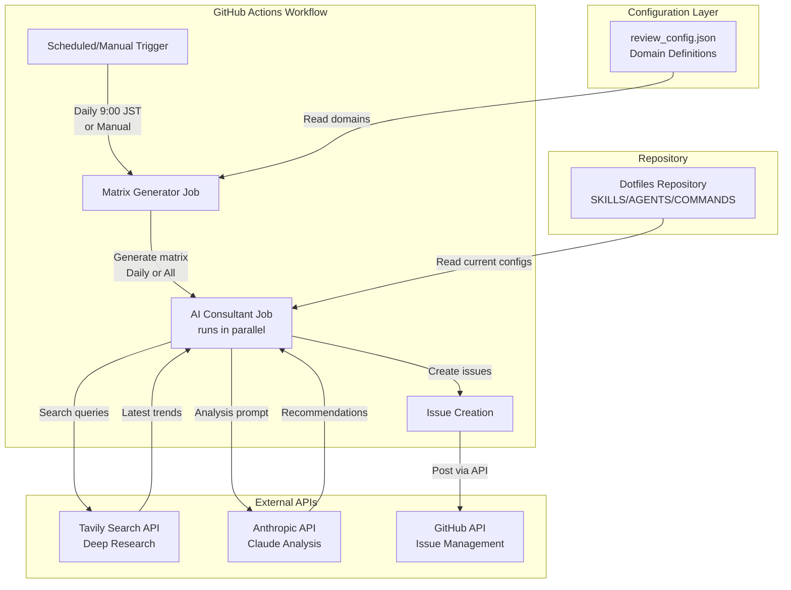
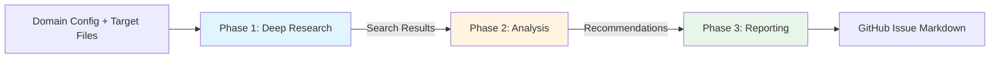
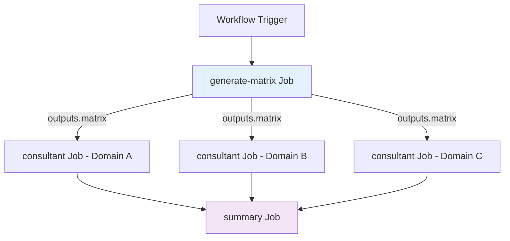
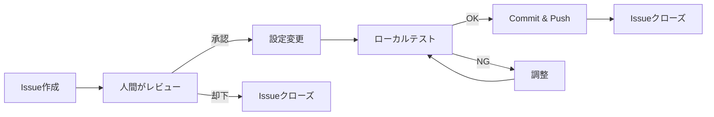

# Deep Research型 AIコンサルタントCI - システム設計書

## 1. 概要と目的

### 1.1 システムの目的
本システムは、dotfilesで管理されているClaude Codeの設定（SKILLS/AGENTS）を継続的に改善するためのCI/CDパイプラインです。以下の価値を提供します：

- **継続的な知識更新**: 最新の技術トレンドを自動的に調査し、設定の陳腐化を防ぐ
- **学習機会の創出**: レビュー結果をIssue化することで、人間が背景を理解しながら適用できる
- **運用負荷の分散**: 毎日異なる領域を少しずつレビューし、一度に大量の変更を避ける
- **品質の向上**: 外部知識（Web検索）と内部コンテキスト（既存設定）を組み合わせた高度な分析

### 1.2 設計思想
- **Non-intrusive**: コードへの直接コミットではなく、Issue提案による人間の判断を尊重
- **Incremental**: 日次の小さな改善サイクルで、継続的な進化を実現
- **Transparent**: 検索結果と分析根拠を明示し、学習効果を最大化
- **Flexible**: 新しい技術領域や分析観点を容易に追加可能な設計

---

## 2. アーキテクチャ概要

### 2.1 システム構成図（Mermaid記法）



### 2.2 登場人物と責務

| コンポーネント | 役割 | 技術要素 |
|------------|------|---------|
| **GitHub Actions Workflow** | オーケストレーション層 | YAML定義、Cron式、Matrix戦略 |
| **Configuration** | ドメイン定義とメタデータ管理 | JSON、バリデーションロジック |
| **Matrix Generator** | 実行対象の動的決定 | Python、日付計算、Matrix JSON出力 |
| **AI Consultant Core** | 3フェーズの分析エンジン | Python、API統合、プロンプトエンジニアリング |
| **External APIs** | 知識ソースと出力先 | REST API、認証管理 |

---

## 3. コンポーネント詳細設計

### 3.1 Configuration (`review_config.json`)

#### 3.1.1 データ構造

```json
{
  "version": "1.0",
  "domains": [
    {
      "id": "typescript-best-practices",
      "name": "TypeScript Best Practices",
      "description": "TypeScript開発におけるコーディング規約とパターン",
      "target_files": [
        ".claude/skills/typescript-best-practices/**/*.md"
      ],
      "schedule": {
        "mode": "weekly",
        "day_of_week": 1
      },
      "search_hints": {
        "primary_keywords": ["TypeScript", "best practices", "2025"],
        "focus_areas": ["型安全性", "パフォーマンス", "ツール連携"],
        "exclude_terms": ["JavaScript基礎", "tutorial"]
      },
      "analysis_context": {
        "current_version": "検証が必要な既存ドキュメントのバージョン情報",
        "priority_aspects": ["セキュリティ", "最新文法対応"]
      }
    }
  ],
  "global_settings": {
    "max_search_results": 10,
    "analysis_temperature": 0.3,
    "issue_labels": ["ai-consultant", "auto-review"]
  }
}
```

#### 3.1.2 設計意図

- **`id`**: システム内部での一意識別子（ファイル名、Issue titleに使用）
- **`schedule.mode`**: `daily`, `weekly`, `monthly`で柔軟な頻度設定
- **`schedule.day_of_week`**: 月曜=1, 日曜=7（ISO 8601準拠）
- **`search_hints`**:
  - `primary_keywords`: Tavily検索の基本クエリ
  - `focus_areas`: 日本語での補足コンテキスト（プロンプトで活用）
  - `exclude_terms`: ノイズ除去用（初心者向けチュートリアルなど）
- **`analysis_context`**: AIへの分析指示を明示化し、再現性を確保

#### 3.1.3 拡張性の考慮

新しい領域追加時は以下の手順で対応：
1. `domains`配列に新しいオブジェクトを追加
2. `target_files`に対象パスを指定（globパターン対応）
3. `search_hints`で検索精度を調整
4. コミット後、次回のスケジュール実行で自動的に組み込まれる

**例: Rust領域の追加**
```json
{
  "id": "rust-async-patterns",
  "name": "Rust非同期プログラミング",
  "target_files": [".claude/skills/rust-async/**/*.md"],
  "schedule": {"mode": "weekly", "day_of_week": 3},
  "search_hints": {
    "primary_keywords": ["Rust async", "tokio", "2025"],
    "focus_areas": ["所有権とライフタイム", "エラーハンドリング"]
  }
}
```

---

### 3.2 Matrix Generator (`generate_matrix.py`)

#### 3.2.1 責務
- 設定ファイルから実行対象ドメインを決定
- GitHub Actions Matrixフォーマットへの変換
- 実行モード（Daily/All）による振り分けロジック

#### 3.2.2 入出力定義

**入力:**
- `review_config.json`: 全ドメイン定義
- 実行モード（環境変数 `MODE`: `daily` or `all`）
- 現在の日時（UTC）

**出力:**
- GitHub Actions Matrix JSON（標準出力経由で`GITHUB_OUTPUT`へ）
```json
{
  "include": [
    {
      "domain_id": "typescript-best-practices",
      "domain_name": "TypeScript Best Practices",
      "target_files": ".claude/skills/typescript-best-practices/**/*.md",
      "search_query": "TypeScript best practices 2025"
    }
  ]
}
```

#### 3.2.3 ロジック定義

**Dailyモード:**
```
1. 現在のUTC日時を日本時間（JST）に変換
2. ISO weekdayを計算（1=月曜, 7=日曜）
3. 全ドメインをフィルタリング:
   - schedule.mode == "daily" → 常に含める
   - schedule.mode == "weekly" かつ schedule.day_of_week == 今日 → 含める
   - schedule.mode == "monthly" かつ 今日が月初（1-7日）かつ day_of_week一致 → 含める
4. Matrixエントリとして整形
```

**Allモード:**
```
1. 全ドメインを無条件で含める
2. Matrixエントリとして整形
```

**Matrixが空の場合:**
- 空配列を出力し、後続のConsultantジョブをスキップ（`if: needs.matrix.outputs.matrix != '[]'`）

#### 3.2.4 設計意図

- **スケジューリングの柔軟性**:
  - 重要度の高いドメイン（TypeScript, Python）は`daily`
  - 変更頻度の低いドメイン（設定ファイル）は`weekly`
  - 実験的な領域は`monthly`で負荷を抑える
- **タイムゾーン考慮**: GitHub Actionsは UTC で動作するため、JSTへの変換を明示的に実施
- **Matrixの最適化**: 並列実行数を制御し、API使用量とコスト効率をバランス

---

### 3.3 AI Consultant Core (`consultant.py`)

#### 3.3.1 3フェーズの処理フロー



---

#### 3.3.2 Phase 1: Deep Research（Tavily API）

**目的:**
最新の技術トレンド、ベストプラクティス、セキュリティ勧告を収集

**処理内容:**
1. **検索クエリの構築**
   ```python
   query = f"{primary_keywords} {focus_areas} {current_year}"
   # 例: "TypeScript best practices 型安全性 パフォーマンス 2025"
   ```

2. **Tavily API呼び出し**
   - `search_depth`: "advanced"（より深い分析を要求）
   - `max_results`: 設定ファイルから取得（デフォルト10件）
   - `include_domains`: 信頼できるソース（例: GitHub公式、Microsoft Docs）を優先
   - `exclude_domains`: 低品質なコンテンツファームを除外

3. **結果のフィルタリング**
   - 公開日が1年以内のコンテンツを優先
   - `exclude_terms`に一致する記事を除外
   - スコアリング上位N件を選択

**出力:**
```python
{
  "sources": [
    {
      "title": "TypeScript 5.5の新機能と移行ガイド",
      "url": "https://example.com/...",
      "published_date": "2025-01-15",
      "relevance_score": 0.92,
      "key_points": ["Inferred Type Predicates", "Control Flow分析の改善"]
    }
  ],
  "summary": "2025年1月時点での主要トレンド要約"
}
```

**設計意図:**
- **品質重視**: 検索深度を"advanced"に設定し、表面的な情報を避ける
- **鮮度管理**: 公開日フィルタで古い情報の混入を防ぐ
- **コンテキスト化**: 単なるURLリストではなく、要点抽出して次フェーズへ渡す

---

#### 3.3.3 Phase 2: Analysis（Anthropic API）

**目的:**
検索結果と既存設定を比較し、具体的な改善提案を生成

**処理内容:**

1. **既存ファイルの読み込み**
   ```python
   # target_filesのglob展開
   current_content = read_files_matching(domain.target_files)
   ```

2. **プロンプトの構築**
   ```
   あなたは技術コンサルタントです。以下の情報を元に、dotfiles内の設定改善案を提案してください。

   ## 現在の設定
   {current_content}

   ## 最新トレンド（2025年1月調査）
   {research_summary}

   ## 分析観点
   - {priority_aspects}

   ## 出力形式
   1. **Gap Analysis**: 現在の設定と最新トレンドの乖離
   2. **Recommendations**: 優先度付きの改善提案（High/Medium/Low）
   3. **Implementation Guide**: 具体的な変更手順
   4. **References**: 根拠となる情報源
   ```

3. **API呼び出しパラメータ**
   - `model`: "claude-sonnet-4.5"（最新の推論能力を活用）
   - `temperature`: 0.3（一貫性重視、創造性は抑える）
   - `max_tokens`: 4000（詳細な分析を許容）

4. **レスポンスのパース**
   - Markdown形式の構造化データとして取得
   - セクション別に抽出（Gap/Recommendations/Implementation）

**出力例:**
```markdown
## Gap Analysis
- 現在のTypeScript設定は4.9系を前提としているが、5.5の新機能が未反映
- `strict`フラグの細分化オプション（exactOptionalPropertyTypes等）が未設定

## Recommendations
### High Priority
- [ ] `tsconfig.json`に`exactOptionalPropertyTypes: true`を追加（型安全性向上）

### Medium Priority
- [ ] Inferred Type Predicatesを活用した型ガードの簡潔化

## Implementation Guide
1. `tsconfig.json`を開く
2. `compilerOptions`に以下を追加...
```

**設計意図:**
- **温度設定0.3の理由**: 技術的正確性を最優先し、幻覚（hallucination）を最小化
- **構造化出力**: そのままIssueに転記できる形式で、人間の編集コストを削減
- **優先度の明示**: High/Medium/Lowで緊急度を可視化し、適用判断を支援

---

#### 3.3.4 Phase 3: Reporting（Issue生成）

**目的:**
分析結果をGitHub Issueとして登録し、追跡可能にする

**処理内容:**

1. **Issueタイトルの生成**
   ```
   [AI Consultant] {domain_name} - {YYYY-MM-DD}レビュー
   # 例: [AI Consultant] TypeScript Best Practices - 2025-01-20レビュー
   ```

2. **Issue本文の構成**
   ```markdown
   ## 🔍 分析概要
   - **対象領域**: {domain_name}
   - **実行日時**: {execution_timestamp}
   - **検索キーワード**: {search_query}

   ## 📊 調査結果
   {Phase 1の検索サマリー}

   ## 💡 改善提案
   {Phase 2の分析結果}

   ## 📚 参考資料
   {検索結果のURLリスト}

   ---
   *このIssueはAI Consultant CIにより自動生成されました。*
   *適用前に内容を精査し、プロジェクトの方針と合致するか確認してください。*
   ```

3. **GitHub API呼び出し**
   - `POST /repos/{owner}/{repo}/issues`
   - ラベル自動付与: `["ai-consultant", "enhancement", domain_id]`
   - Assignee: 設定ファイルで指定可能（デフォルトは未割当）

4. **エラーハンドリング**
   - API制限エラー時: 指数バックオフでリトライ（最大3回）
   - 重複Issue検出: タイトルで既存Issue検索し、コメント追加に切り替え

**設計意図:**
- **トレーサビリティ**: 実行日時と検索条件を明記し、後から検証可能に
- **アクション性**: チェックボックス形式で、適用状況を追跡
- **免責事項**: AI生成であることを明示し、人間の最終判断を促す

---

## 4. ワークフロー定義 (`ai-consultant.yml`)

### 4.1 トリガー条件

```yaml
on:
  schedule:
    - cron: '0 0 * * *'  # 毎日 9:00 JST (UTC 0:00)
  workflow_dispatch:
    inputs:
      mode:
        description: '実行モード'
        required: true
        default: 'daily'
        type: choice
        options:
          - daily
          - all
```

**設計意図:**
- **定期実行**: 毎朝9時に自動レビューを実施し、業務開始時に確認可能
- **手動実行**:
  - `daily`: 今日の担当ドメインのみ実行（動作確認用）
  - `all`: 全ドメインを一括レビュー（月次総点検や設定追加後の初回実行）

### 4.2 ジョブ構成



#### 4.2.1 Job 1: `generate-matrix`

```yaml
jobs:
  generate-matrix:
    runs-on: ubuntu-latest
    outputs:
      matrix: ${{ steps.set-matrix.outputs.matrix }}
      has_domains: ${{ steps.set-matrix.outputs.has_domains }}
    steps:
      - uses: actions/checkout@v4
      - name: Generate matrix
        id: set-matrix
        run: |
          matrix=$(python scripts/generate_matrix.py)
          echo "matrix=$matrix" >> $GITHUB_OUTPUT
          if [ "$matrix" = "[]" ]; then
            echo "has_domains=false" >> $GITHUB_OUTPUT
          else
            echo "has_domains=true" >> $GITHUB_OUTPUT
          fi
```

**データの受け渡し:**
- `outputs.matrix`: 次のジョブの`strategy.matrix`に展開
- `outputs.has_domains`: 空判定用（後続ジョブのスキップ制御）

---

#### 4.2.2 Job 2: `consultant`（Matrix並列実行）

```yaml
  consultant:
    needs: generate-matrix
    if: needs.generate-matrix.outputs.has_domains == 'true'
    runs-on: ubuntu-latest
    strategy:
      matrix: ${{ fromJSON(needs.generate-matrix.outputs.matrix) }}
      fail-fast: false  # 1つのドメインが失敗しても他は継続
      max-parallel: 3   # API制限考慮（同時実行数制限）
    steps:
      - uses: actions/checkout@v4
      - name: Run AI Consultant
        env:
          TAVILY_API_KEY: ${{ secrets.TAVILY_API_KEY }}
          ANTHROPIC_API_KEY: ${{ secrets.ANTHROPIC_API_KEY }}
          GITHUB_TOKEN: ${{ secrets.GITHUB_TOKEN }}
        run: |
          python scripts/consultant.py \
            --domain-id "${{ matrix.domain_id }}" \
            --config review_config.json
```

**並列実行の制御:**
- `fail-fast: false`: TypeScriptレビュー失敗時もPythonレビューは継続
- `max-parallel: 3`: Tavily API の rate limit（例: 100req/min）を考慮

**エラーハンドリング戦略:**
1. **Phase 1失敗（検索エラー）**:
   - Issue作成はスキップ
   - Slackなどへアラート（オプション）
   - ジョブステータスは`failure`だが他ドメインは継続
2. **Phase 2失敗（API制限）**:
   - 指数バックオフリトライ
   - 最終的に失敗した場合、エラー内容をIssueに記録
3. **Phase 3失敗（Issue作成失敗）**:
   - 分析結果をArtifactに保存（手動Issue化用）

---

#### 4.2.3 Job 3: `summary`（統括レポート）

```yaml
  summary:
    needs: consultant
    if: always()  # consultantが一部失敗しても実行
    runs-on: ubuntu-latest
    steps:
      - name: Create summary issue
        run: |
          # 実行されたドメイン一覧
          # 成功/失敗の統計
          # 次回実行予定
          # を含むサマリーIssueを作成
```

**設計意図:**
- 日次レポートとして、実行状況を一元管理
- 失敗したドメインを即座に把握し、設定調整へフィードバック

---

### 4.3 シークレット管理

| シークレット名 | 用途 | 取得方法 |
|------------|------|---------|
| `TAVILY_API_KEY` | 検索API認証 | https://tavily.com/ で取得 |
| `ANTHROPIC_API_KEY` | Claude API認証 | Anthropic Consoleで取得 |
| `GITHUB_TOKEN` | Issue作成権限 | GitHub Actionsデフォルト提供（`contents: read`, `issues: write`権限必要） |

**セキュリティ考慮:**
- APIキーはGitHub Secretsに保存し、コードには含めない
- ワークフロー実行ログにAPIレスポンスを出力しない（デバッグ時は注意）

---

## 5. 拡張性と保守性

### 5.1 新しい技術領域の追加

**シナリオ**: Rustの非同期プログラミング領域を追加

**手順:**
1. **設定追加**
   ```bash
   # review_config.jsonを編集
   vim review_config.json
   # domains配列に新規エントリ追加
   ```

2. **対象ファイル準備**
   ```bash
   mkdir -p .claude/skills/rust-async
   touch .claude/skills/rust-async/README.md
   ```

3. **初回レビュー実行**
   ```bash
   # GitHub Actionsで手動実行（mode: all）
   # または次回のスケジュール実行を待つ
   ```

4. **検索精度のチューニング**
   - 初回Issue内容を確認
   - `search_hints.exclude_terms`を調整（ノイズが多い場合）
   - `focus_areas`を具体化（関連性が低い場合）

**必要なコード変更:** なし（設定駆動で完結）

---

### 5.2 検索クエリの最適化

**問題**: TypeScriptレビューで初心者向けチュートリアルが多く混入

**対応手順:**
1. `review_config.json`の該当ドメインを編集
   ```json
   "search_hints": {
     "exclude_terms": ["beginner", "tutorial", "入門", "初心者"],
     "include_domains": ["github.com", "typescriptlang.org"]
   }
   ```

2. 次回実行で自動反映

**ベストプラクティス:**
- 月次で各ドメインのIssue品質をレビュー
- 検索結果の`relevance_score`分布を分析
- 低スコア記事が多い場合はクエリ調整

---

### 5.3 分析観点のカスタマイズ

**シナリオ**: セキュリティ重視のプロジェクトで脆弱性検出を強化

**方法:**
1. グローバル設定に分析テンプレート追加
   ```json
   "global_settings": {
     "analysis_templates": {
       "security-focused": {
         "system_prompt": "セキュリティ専門家として、OWASP Top 10を考慮した分析を実施",
         "priority_aspects": ["脆弱性", "認証", "暗号化"]
       }
     }
   }
   ```

2. ドメイン定義で参照
   ```json
   "analysis_context": {
     "template": "security-focused"
   }
   ```

---

### 5.4 Multi-Repository対応（将来拡張）

**現在の制限**: 単一リポジトリ（dotfiles）のみ対象

**拡張案:**
1. `review_config.json`にリポジトリ情報追加
   ```json
   "domains": [
     {
       "id": "project-a-typescript",
       "repository": "org/project-a",
       "target_files": "src/**/*.ts"
     }
   ]
   ```

2. `consultant.py`で`actions/checkout`を動的実行

**考慮事項:**
- 複数リポジトリへのアクセス権限管理
- GitHub Apps tokenの利用（GITHUB_TOKENの制限回避）

---

## 6. 運用シナリオ

### 6.1 典型的な1週間の運用フロー

| 曜日 | 自動実行内容 | 人間の作業 |
|-----|-----------|----------|
| 月曜 | TypeScript, Python領域レビュー | 朝9時: Issue確認、優先度判断 |
| 火曜 | CI/CD設定レビュー | 前日のHigh提案を適用 |
| 水曜 | Skills定義レビュー | - |
| 木曜 | Agent設定レビュー | 週次: 適用済みIssueのクローズ |
| 金曜 | セキュリティ設定レビュー | 週次サマリーIssue確認 |
| 土日 | 実行なし | - |

### 6.2 Issue適用フロー



**判断基準:**
- **High Priority**: 1週間以内に対応
- **Medium Priority**: 1ヶ月以内に検討
- **Low Priority**: 次回大規模リファクタ時に考慮

---

## 7. コストと制限事項

### 7.1 API使用量の見積もり

**前提条件:**
- ドメイン数: 10個
- 平均実行頻度: 1ドメイン/日（Daily: 3, Weekly: 7で曜日分散）

**Tavily API:**
- 1ドメイン = 1検索リクエスト
- 月間: 30リクエスト
- コスト: 無料プラン（1000req/月）で十分

**Anthropic API:**
- 1ドメイン = 1 Claude呼び出し
- 入力トークン: 約5000（既存設定 + 検索結果）
- 出力トークン: 約4000（分析レポート）
- 月間: 30回 × (5000 + 4000) = 270K tokens
- コスト: Claude Sonnet 4で約$1.5/月

**GitHub Actions:**
- 1ドメイン = 約5分実行
- 月間: 150分（無料枠2000分内）

**合計月額コスト:** 約$2（APIコストのみ）

### 7.2 制限事項

| 項目 | 制限内容 | 回避策 |
|------|---------|--------|
| Tavily検索深度 | Advanced検索でもソース数に限界 | 重要領域はmanual補完 |
| Claude Token上限 | 200K入力制限 | 大規模設定はファイル分割 |
| GitHub Actions実行時間 | 1ジョブ最大6時間 | 現実的に問題なし |
| Issue Spam防止 | 毎日Issueが増える | 週次でレビュー済みIssueを自動クローズ |

---

## 8. 成功指標（KPI）

### 8.1 システム健全性

- **実行成功率**: 95%以上（月間）
- **平均Issue作成時間**: 5分以内/ドメイン
- **API障害率**: 1%未満

### 8.2 品質指標

- **Issue適用率**: 30%以上（High Priority提案）
- **重複提案率**: 10%未満（同じ内容のIssueが繰り返されない）
- **検索結果鮮度**: 80%以上が6ヶ月以内の情報

### 8.3 学習効果

- **月次の設定更新回数**: 4回以上
- **人間のレビュー時間**: 平均15分/日（負荷が過大でないこと）

---

## 9. リスクと緩和策

| リスク | 影響 | 緩和策 |
|-------|------|--------|
| API障害による実行失敗 | 当日のレビュー中断 | リトライロジック + 翌日再実行 |
| 誤った提案による設定破壊 | 動作不良 | Issue経由での人間判断必須化 |
| 検索結果の偏り | 品質低下 | 多様なソース確保（複数検索エンジン併用検討） |
| トークンコスト超過 | 予算オーバー | 月次上限アラート + 実行頻度調整 |

---

## 10. 今後の発展性

### 10.1 Phase 2拡張案

- **自動プルリクエスト生成**: 信頼性が確立した後、Low riskな変更は自動PR
- **Slack/Discord通知**: Issue作成時に通知し、レビュー漏れ防止
- **ダッシュボード化**: 適用率、トレンド推移をGitHub Pagesで可視化

### 10.2 Machine Learning活用

- **提案精度の学習**: 人間の承認/却下履歴から、優先度付けを自動調整
- **異常検出**: 設定ファイルの構文エラーや矛盾を事前検出

---

## 11. まとめ

本設計書は、以下の原則に基づいて構築されています：

1. **人間中心設計**: AIは提案のみ、最終判断は人間が実施
2. **段階的改善**: 一度に大量変更せず、日々の小さな積み重ね
3. **透明性**: 分析根拠を明示し、学習機会を創出
4. **拡張性**: 新しい技術領域を容易に追加可能
5. **コスト効率**: 月額$2程度で継続的な品質向上を実現

このシステムにより、dotfilesの設定が常に最新のベストプラクティスに追従し、開発者の生産性向上に貢献します。

---

**次のステップ:**
1. この設計書をレビューし、要件の過不足を確認
2. 必要に応じて設計の修正・追加
3. 承認後、実装フェーズへ移行